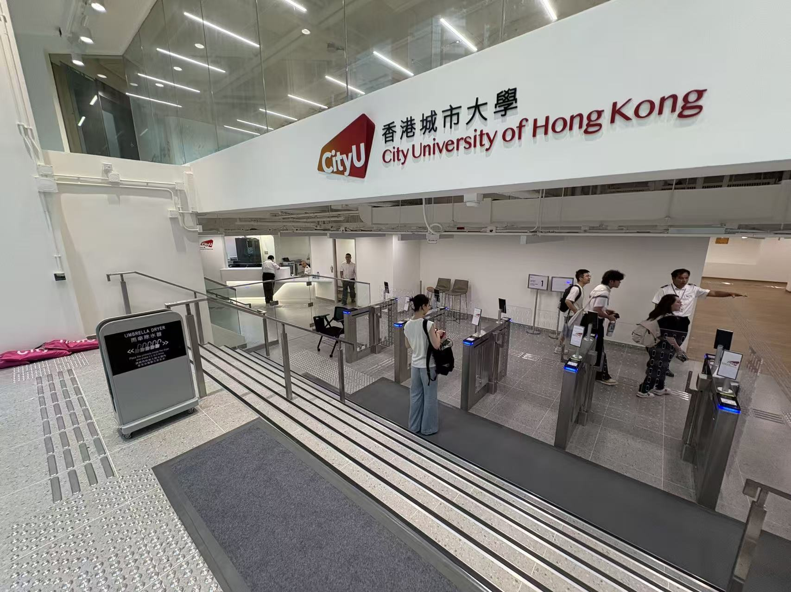
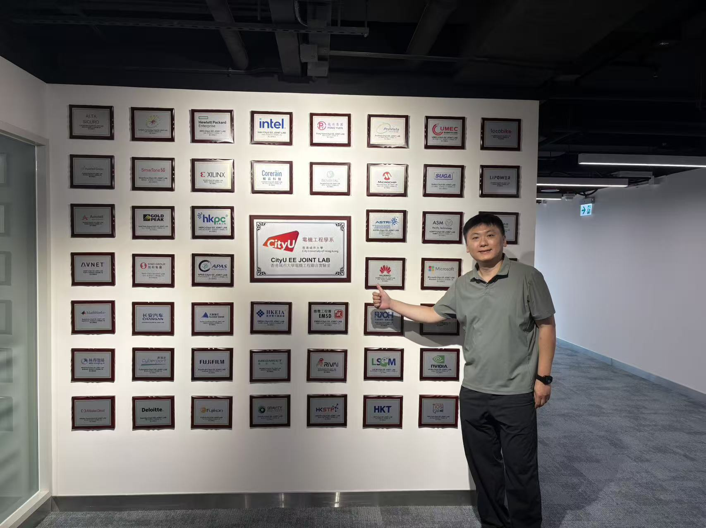
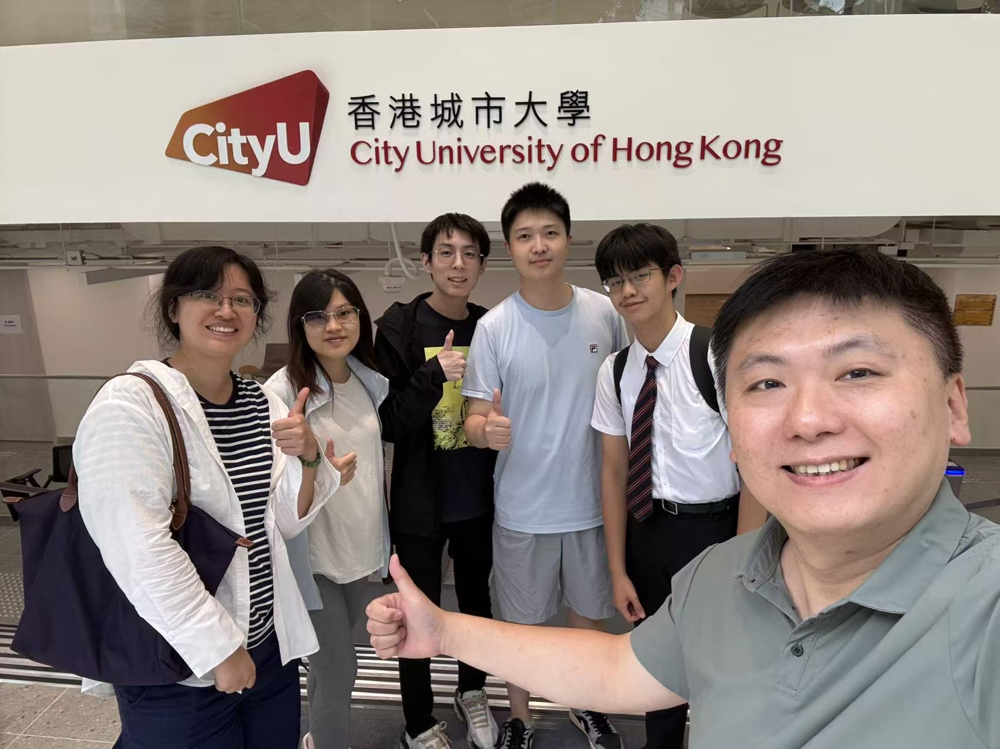
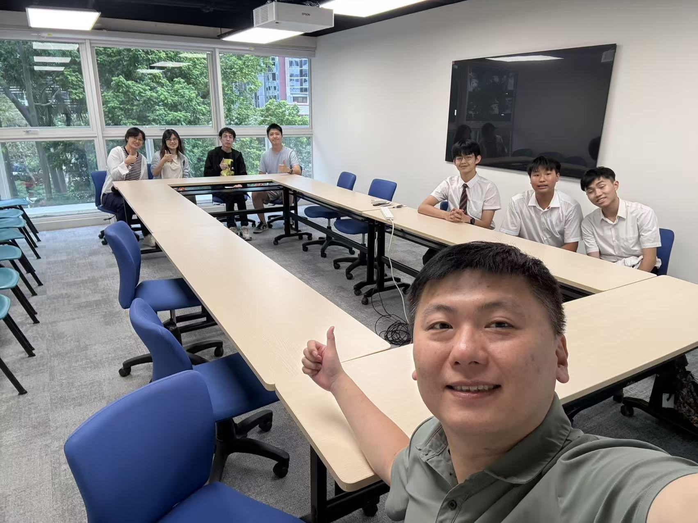

An important update on our lab and office space: all team members will be moved to Tsim Sha Tsui East (TST East), while Kowloon Tong remains our core base.

<!--more-->

The new lab and office are at Intercontinental Plaza (ICP) in TST East, the CityUHK EE site also used by the [Enterprise Innovation Hub (EIH)](https://www.ee.cityu.edu.hk/en/events/upcoming_events). TST East (尖東) sits east of Chatham Road South on land reclaimed from Hung Hom Bay. It is a compact commercial district of offices, hotels, and pedestrian plazas, served by East Tsim Sha Tsui MTR station and linked to the harbourfront.

Kowloon Tong remains CALAS's core academic base on the CityUHK campus. The TST East space gives the group a second site for daily research, team operations, and closer engagement with industry in Kowloon.

The group had a nice EE lab visit today. Fred and team members already working at ICP, more photos of the new space are welcome. All members, get prepared for the new lab space.

| | |
|:---:|:---:|
|  |  |
|  |  |
