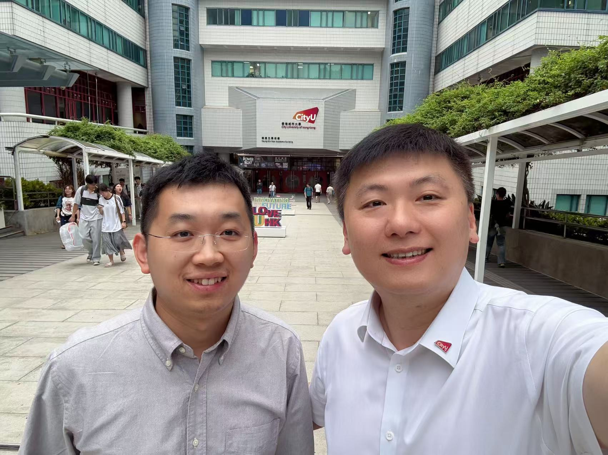
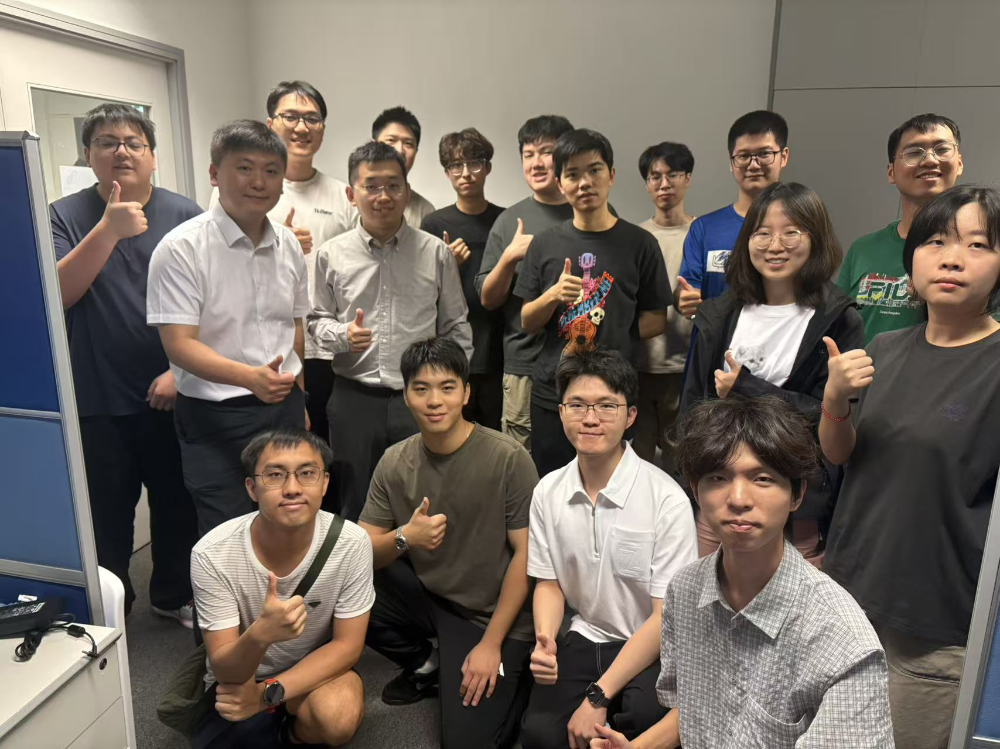

CALAS was glad to welcome Dr. Liu to the lab today, where the team shared our research work.

<!--more-->

Dr. Liu Hongbin (刘弘斌), a former Microsoft quantum expert and founder of the Shanghai-based neutral-atom quantum computing company Taiyi Quantum (太一量生), visited CALAS. During the visit, members of the group introduced our ongoing research and exchanged ideas with Dr. Liu.

The visit was a valuable opportunity for the team to present our work, learn from industry developments in quantum technology, and keep engaging beyond day-to-day research. Glad to see all team members actively learning daily.

Related reading: [Shanghai aims to lead quantum technology applications](https://sh.people.com.cn/BIG5/n2/2026/0608/c138654-41603961.html) (*Jiefang Daily* / People's Daily Shanghai).

|  |  |
|:---:|:---:|
