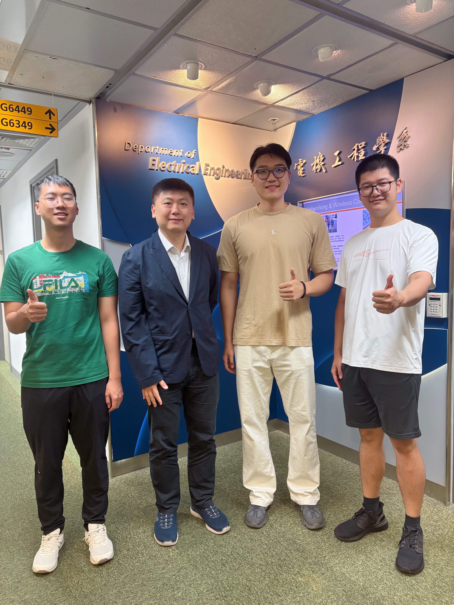
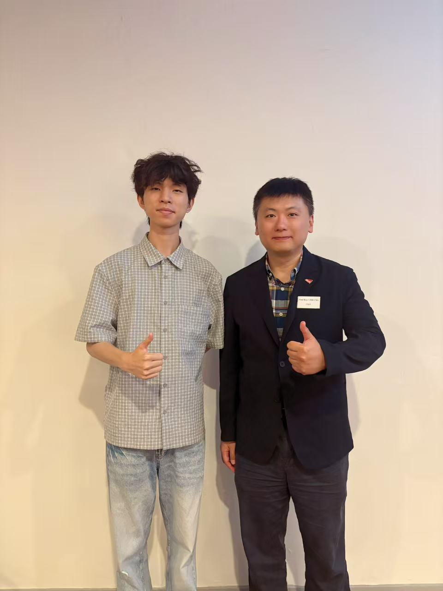

CALAS warmly welcomes Frisk Huang, Yann Zhang, Charlie Chang, and Justin Ju as they begin their MPhil studies with the group.

<!--more-->

We are delighted to welcome four new MPhil students to CALAS under the supervision of **Prof. Ray C. C. Cheung**. Frisk, Yann, Charlie, and Justin join the group to begin their two-year MPhil studies in Hong Kong.

**Frisk HUANG** studied Integrated Circuit Design and Integrated Systems, with a focus on front-end and back-end IC design, low-power techniques, and SoC architecture. His work aims at high-performance, energy-efficient chips under advanced process nodes.

**Yann ZHANG** completed his undergraduate studies in integrated circuit design at South China University of Technology (SCUT). His research interests include FPGA-based hardware acceleration, SoC design, and embedded systems.

**Charlie CHANG** received his BEng in Automation from Harbin Institute of Technology, Shenzhen. Through the CityUHK 3+1+2 programme in Qingdao, he now continues as an MPhil student. His research interests include RISC-V out-of-order execution and the security–performance balance in speculative execution.

**Justin JU** (Jiaxing Ju) received his BEng in Microelectronic Science and Engineering from South China University of Technology. His interests include digital hardware design, embedded systems, and hardware security for IoT devices.

A warm welcome to Frisk, Yann, Charlie, and Justin as they begin their MPhil studies with CALAS. We look forward to the work they will do with the group.

 

  
  

