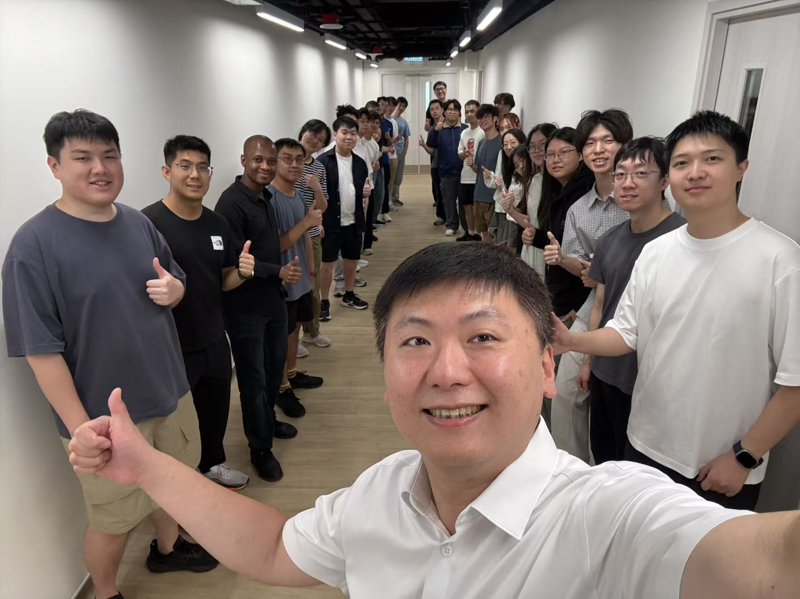
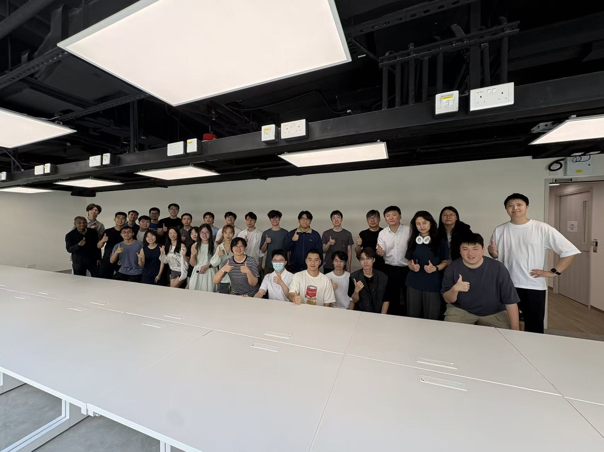
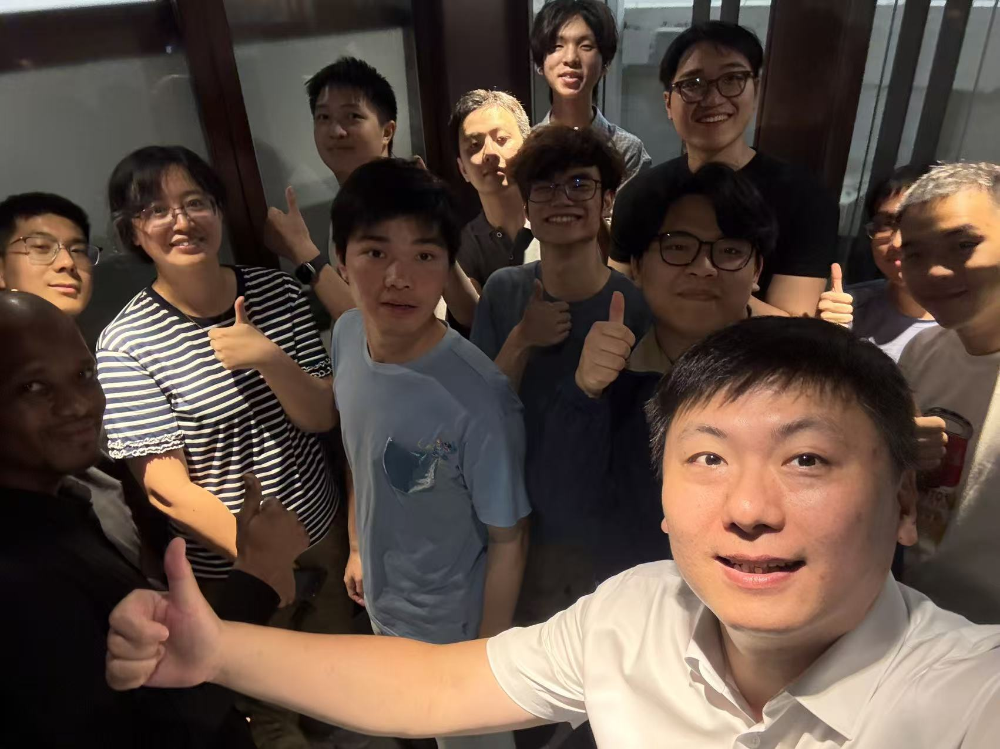
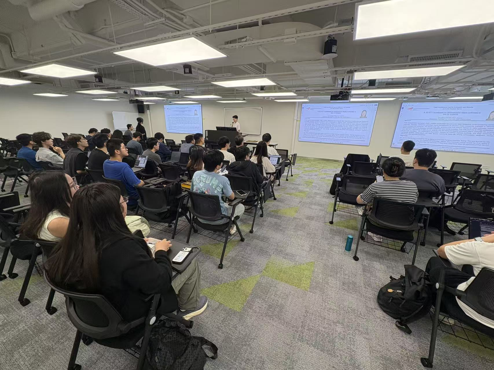

CALAS held its first regular group meeting at Intercontinental Plaza (ICP) in Tsim Sha Tsui East on September 15, marking an exciting step toward the group's new lab and office space.

<!--more-->

CALAS members gathered at ICP in Tsim Sha Tsui East (TST East) for the group's first regular meeting at the new location. The meeting marked the beginning of an exciting transition as CALAS prepares to move into its new lab and office space.

The TST East location will provide a larger, more connected environment for research, discussion, and collaboration. We look forward to making the new CALAS space a lively home for the group and to the opportunities ahead.

 

  
  
  
  

