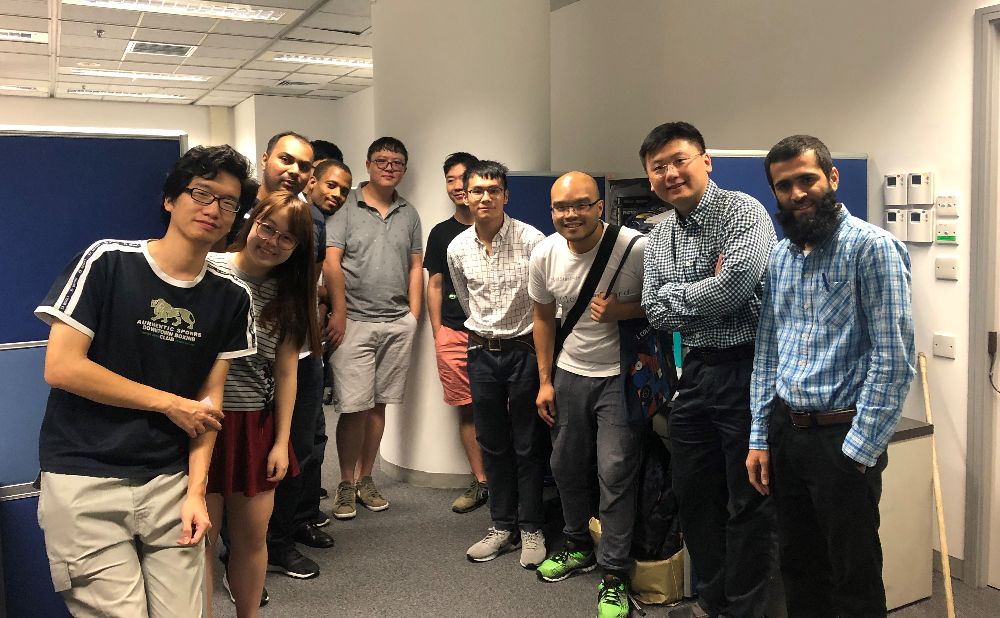
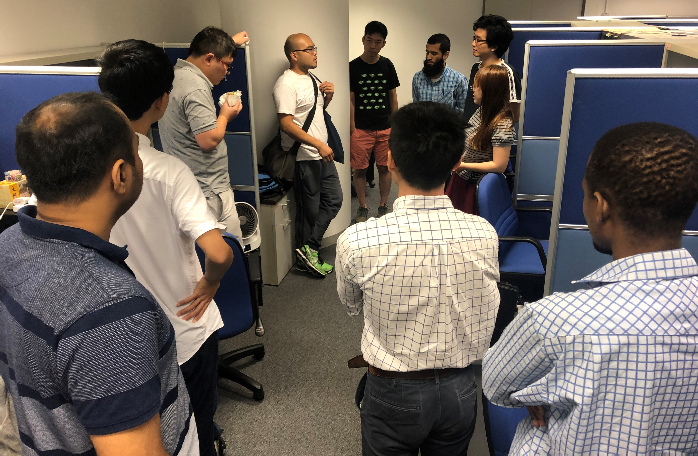

Today we have our CALAS former Postdoc alumni, PhD in Imperial College London, Dr. YU visiting our office in EE department.
<!--more-->
|  |  |
|-----------------|-----------------|

Now he is a system engineer from Syner wealth technology and gave CALAS members an invaluable information about current development of FPGA in the financial and Fintech industry.