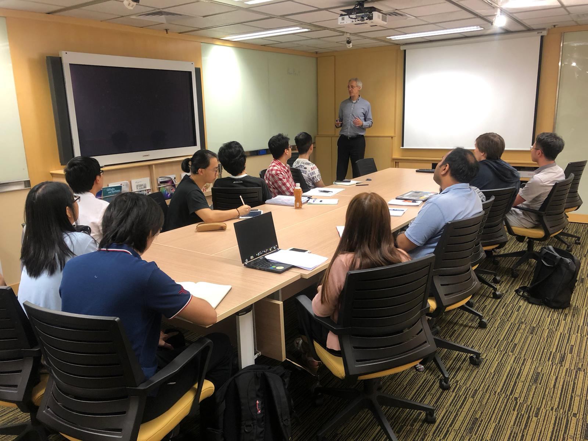

Prof. Mencer has visited the bi-weekly research team meeting today, and provided valuable advice to PhD, Master, and Final year project students.
<!--more-->
|  |  |
|-----------------|-----------------|

He also introduced the bonding, the academic family tree, between CALAS and Prof. Galileo Galilei, the father of modern physics.

For more information:[Link]( http://maxeler.com/)