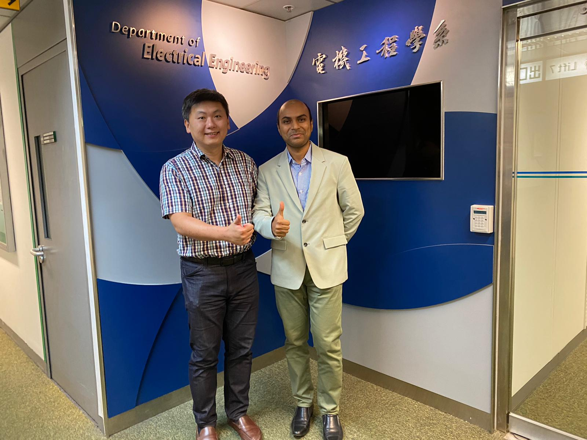
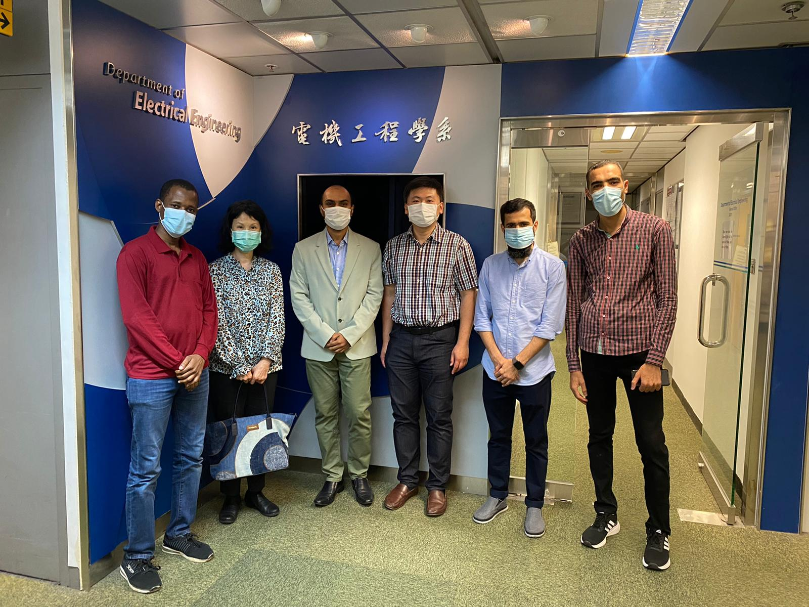

<!--more-->

|  |  |
|-----------------|-----------------|

Many congratulations to Dr. Mehdi Hasan for successfully defending his PhD thesis and getting the Doctor title. He is the 13th happy PhD graduate of CALAS team. Dr. Mehdi will join the Assistant Professor position in Bangladesh. The team wish him all the best of his future endeavors.