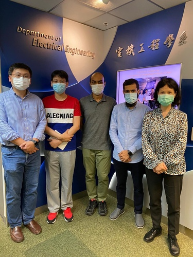

<!--more-->

To recognize the good performance of Teaching Assistants, Department will present Outstanding Teaching Assistant Awards this year to Teaching Assistants who performed teaching duties in tutorial and/or laboratory sessions by considering the TLQ results, student comments, and the assessments by course lecturers/technical staff. Big congratulations to our excellent PhD CALAS team. Out of 4 winners, 3 of them are from CALAS in 3 different courses, Logic design, computer architecture and security technology. Congratulations to Mehdi, Irfan, and Yang. And all the support from our PhD team, Sanka, Gavin, Candice, Gary, Ajita, Yao, Vic, and Kit, and all the Senior year CALAS members!