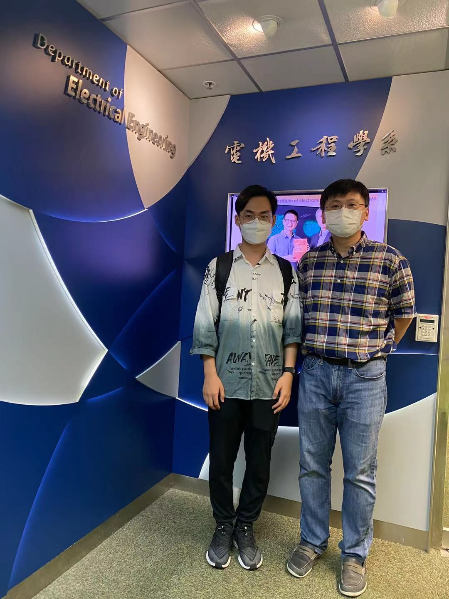

<!--more-->

Warmly welcome Yuhan to join our CALAS family! Yuhan SHE received his B.Eng degree in 2021 from Zhejiang University, majoring in Electrical Engineering. He will officially start his Ph.D. study from October 1, 2021.