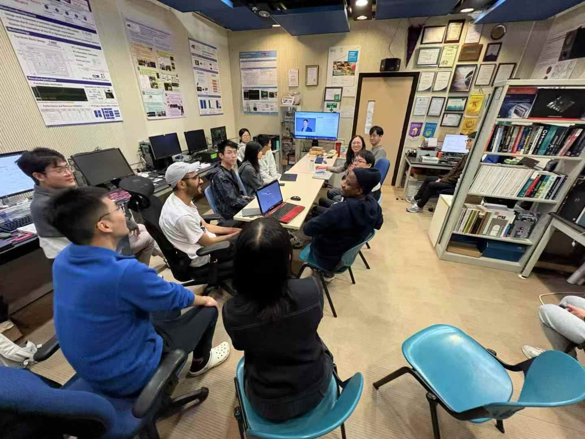
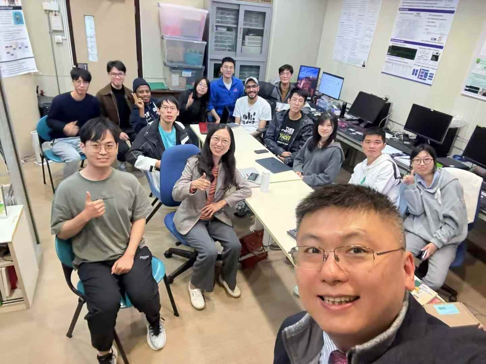
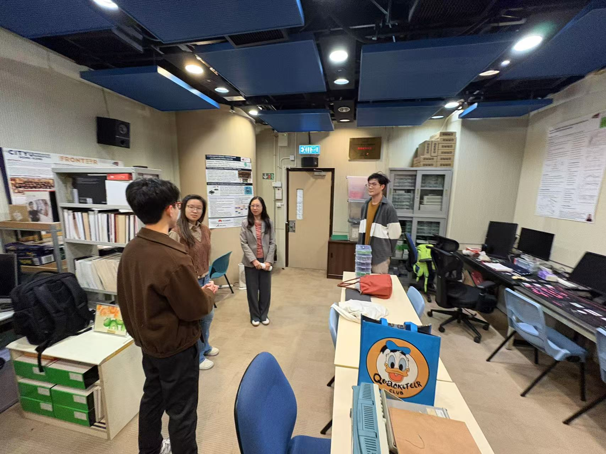
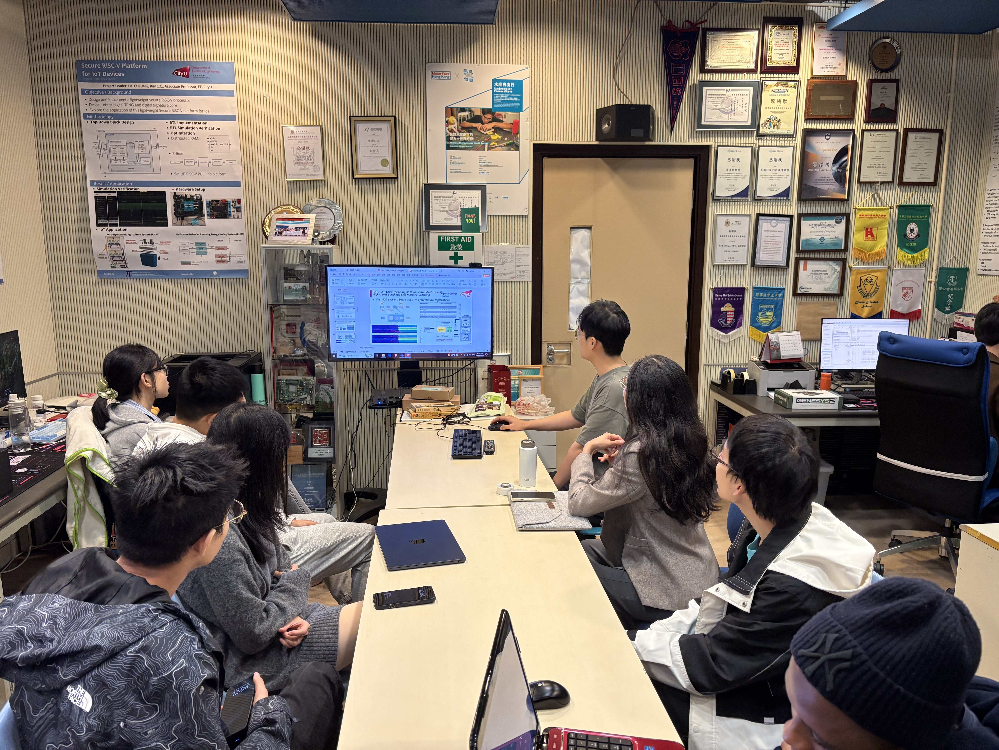

<!--more-->

|  |  |
|-----------------|-----------------|
|  |  |

On November 26, CALAS had the pleasure of hosting Prof. Erica Han and her student from Tsinghua Shenzhen International Graduate School. During her visit, we introduced our ongoing research and recent achievements, including our latest projects and innovative contributions. Prof. Han shared her expertise in domain-specific computation, sensory networks, and video image processing, highlighting their applications in futuristic networks and smart agriculture.

Prof. Han and Prof. Ray share a long-standing academic connection, having worked together during their time at UCLA, where she pursued her PhD and Prof. Ray served as a postdoc. Their reunion marked a valuable exchange of ideas and research perspectives.

We look forward to deepening our collaboration with a reciprocal visit to her group in Shenzhen soon. This meeting reaffirmed the CALAS commitment to fostering interdisciplinary collaborations and broadening our research horizons. Special thanks to Prof. Han for this inspiring interaction!